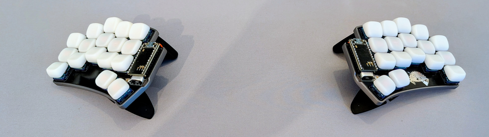

# [Sweep](https://github.com/davidphilipbarr/Sweep)

### Component List

- 1x PCB Kit
- 34x Low Profile Hot Swap Socket
- 2x reset switch
- 2x power switch
- 2x EZ-Solder Machine Sockets and Headers
- 2x nice!nano v2
- 2x 110mAh 301230r battery
- 34x Kailh Choc Bokeh Low Profile Switch
- 34x KLP Lamé Keycaps
- 1x Crab Broom Aluminium Case Kit Grey
- 2x Manfrotto Pocket Support Large Black

### Notes

Keycaps where 3d printed on JCL3DP

Switches are lubed with Krytox GPL-205G0

Keymap inspired from [miryoku](https://github.com/manna-harbour/miryoku)

### Images

